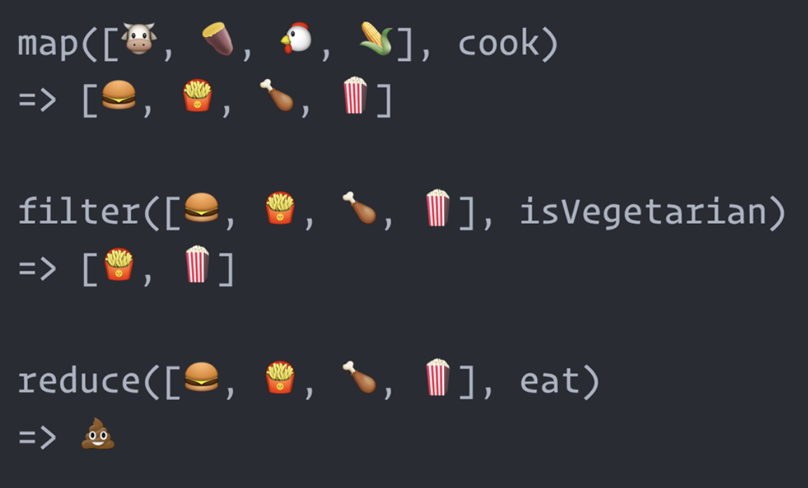

The classic explanation:



## Map

🤔 I have: an array 

💡 I want: an different array of the same size

```js
// [{ years: 7, first_name: 'jeep' }, { years: 4, first_name: 'spot' }]

// we want to change the keys of this object.
// whatever we return from .map's callback will fill in the array
const newArray = items.map(item => {
    return {
        age: item.years, 
        name: item.first_name 
    };
})

// surround the object in parens to do implicit return from the arrow function
// this is equivalent to the one above
const newArray = items.map(item => ({ 
    age: item.years, 
    name: item.first_name 
}))

// gives us [{ age: 7, name: 'jeep' }, { age: 4, name: 'spot' }]
```

## Filter

🤔 I have: an array 

💡 I want: a smaller array (usually)

```js
const filteredArray = items.filter(item => item.age === 25)
```

## Find

🤔 I have: an array 

💡 I want: a single item in that array

```js
const match = items.find(item => item.id === 324)
```

## Find Index

🤔 I have: an array 

💡 I want: the index of a single item in that array

🤷‍♂️ Why?: Usually needed for `slice` or `splice`, which wants an index 

```js
const matchingIndex = items.findIndex(item => item.id === 324)
```

## Reduce

🤔 I have: an array 

💡 I want: _anything_

Reduce uses what's called the _accumulator_ pattern.

In this example below, our accumulator is the array called `olderPeople`

It gets bigger over time--_accumulates_ information as we loop through the array.

```js
// find all people over 25

const olderPeople = [];

for (let person of people) {
    if (person.age > 25) {
        olderPeople.push(person)
    }
}

// olderPeople is now filled with all the older people from the initial data
```

How can we do this with an array method. 

Obviously filter would work, but here's how you would do it with reduce:

```js
// reduce has 2 arguments, a callback and the initial accumulator
// in this case, our initial accumulator is an empty array. We'll change it over time as we loop.
// olderPeople is whatever the FINAL ACCUMULATOR is
const olderPeople = people.reduce((accumulator, currentPerson) => {
    // here inside of our callback, we need access to 2 things:
    // the current state of the accumulator
    // and the current thing we're looking at in our loop
    if (currentPerson.age > 25) {
        accumulator.push(person)
    }

    // whatever we return from the callback becomes the accumulator for the next item.
    return accumulator
}, [])
```

The classic reduce example is when you want to add up everything in an array.

```js
let sum = 0;

for (let person of people) {
    sum += person.age
}
```

```js
const sum = people.reduce((accumulator, currentPerson) => {
    const numberSoFar = accumulator + currentPerson.age;

    return numberSoFar;
}, 0)
```

```js
const sum = people.reduce((accumulator, currentPerson) => accumulator + currentPerson.age, 0)
```

```js
const animals = [ 
    { name: 'spunky', type: 'dog' }, 
    { name: 'freddy', type: 'frog' }, 
    { name: 'jeep', type: 'dog' }, 
    { name: 'sassy', type: 'cat' }, 
    { name: 'froggy', type: 'frog' },
];

const result = { dog: 2, frog: 1 };
```

```js
const countingHashMap = {};

for (let animal of animals) {
    // check to see if my hashMap already has a value with this key
    if (countingHashMap[animal.type]) {
        // if it does, increment
        countingHashMap[animal.type]++
    } else {
        // if it does NOT initialize
        countingHashMap[animal.type] = 1
    }
}
```

```js
const countingHashMap = animals.reduce((accumulator, animal) => {
        // check to see if my hashMap already has a value with this key
    if (accumulator[animal.type]) {
        // if it does, increment
        accumulator[animal.type]++
    } else {
        // if it does NOT initialize
        accumulator[animal.type] = 1
    }

    return accumulator;
}, {})
```